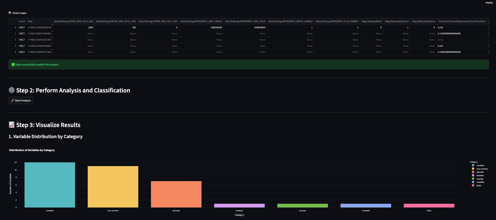

# Variable Classification App
### Automatisierte Klassifikation von Maschinenvariablen mit Machine Learning

[](https://sensor-time-series-variable-classification-app-692cubcxhwiy9fs.streamlit.app/)

> **Ein intelligentes Data Science Tool zur automatisierten Analyse und Klassifikation von Sensor- und Maschinendaten**


---

## Inhaltsverzeichnis

1. [Projektbeschreibung](#-projektbeschreibung)
2. [Problemstellung](#-problemstellung)
3. [Methodologie](#-methodologie)
4. [Features](#-features)
5. [Anwendungsgebiete](#-anwendungsgebiete)
6. [Installation & Setup](#-installation--setup)
7. [Verwendung](#-verwendung)
8. [Anwendungsbeispiele](#-anwendungsbeispiele)
9. [Technische Architektur](#-technische-architektur)
10. [Screenshots](#-screenshots)
11. [Lizenz](#-lizenz)
12. [Kontakt](#-kontakt)

---

## Projektbeschreibung

Das **Variable Classification App** ist eine innovative Data Science-Lösung zur automatisierten Klassifikation und Analyse von Maschinenvariablen. Das Tool wurde entwickelt, um Datenanalysten und Engineers bei der effizienten Bewertung großer Mengen von Sensor- und Maschinendaten zu unterstützen.

### Warum ist dieses Projekt wichtig?

In der modernen Industrie 4.0 generieren Maschinen und Sensoren **Tausende von Variablen** kontinuierlich. Eine typische CNC-Maschine kann bis zu **500+ Parameter** gleichzeitig überwachen - von Temperatursensoren über Positionsdaten bis hin zu Konfigurationswerten. 

**Das zentrale Problem:** Welche dieser Hunderten von Variablen sind tatsächlich wertvoll für die Analyse?

-  **Zeitersparnis**: Reduziert die manuelle Sichtung von Hunderten Variablen von Tagen auf Minuten
-  **Intelligente Vorfilterung**: Automatische Erkennung relevanter Sensordaten
-  **Datenqualität**: Identifikation problematischer oder konstanter Variablen
-  **Skalierbarkeit**: Einheitliche Analyse verschiedener Maschinentypen und Datenquellen

---

##  Problemstellung

### Herausforderungen in der industriellen Datenanalyse:

1. **Datenüberflutung**: Moderne Maschinen generieren 100-1000+ Variablen
2. **Heterogene Datenformate**: CSV, Excel, verschiedene Trennzeichen und Dezimalformate
3. **Unbekannte Relevanz**: Welche Variablen enthalten aussagekräftige Information?
4. **Zeitaufwand**: Manuelle Sichtung dauert Wochen bei großen Datensätzen
5. **Domänenwissen**: Nicht alle Analysten kennen spezifische Maschinenvariablen

### Lösung durch automatisierte Klassifikation:

```
mermaid
graph TD
    A[Rohdaten Upload] --> B[Automatische Format-Erkennung]
    B --> C[Statistische Analyse]
    C --> D[Regelbasierte Klassifikation]
    D --> E[Machine Learning Clustering]
    E --> F[Intelligente Empfehlungen]
    F --> G[Interaktive Visualisierung]
    G --> H[Exportierte Ergebnisse]
    
    style A fill:#e1f5fe
    style H fill:#c8e6c9
    style F fill:#fff3e0
```

---

## Methodologie

Das System verwendet einen **hybriden Ansatz** aus regelbasierter Klassifikation und unüberwachtem Machine Learning:


### 1. **Datenerfassung & Normalisierung**
- Automatische Erkennung von CSV/Excel-Formaten
- Intelligente Behandlung verschiedener Trennzeichen (`;`, `,`, `\t`)
- Dezimalformat-Konvertierung (Deutsch `,` → International `.`)

### 2. **Feature Engineering**
- Statistische Kennzahlen: Mittelwert, Standardabweichung, Schiefe
- Zeitreihenanalytik: Änderungshäufigkeit, Trends, Ausreißer
- Verteilungsanalyse: Perzentile, Extremwerte, Monotonie

### 3. **Regelbasierte Klassifikation**
```python
Kategorien:
├── konstant       → Konfigurationswerte (keine Änderung)
├── boolean        → Binäre Schalter/Status (0/1)
├── status         → Seltene Modus-Änderungen (<10 Wechsel)
├── sensorwert     → Kontinuierliche Messwerte
├── zähler         → Monoton steigende Werte
├── instabil       → Hohe Variabilität/Ausreißer
└── rauschsignal   → Niederfrequente Schwankungen
```

### 4. **Perzentilbasierte Clustering** (Finaler Ansatz)
- Adaptive Schwellenwerte basierend auf Datenverteilung
- K-Means Clustering mit automatischer Clusterbenennung
- Semantische Interpretation: "Energiesensoren", "Digitale Trigger", etc.

### 5. **Intelligentes Empfehlungssystem**
- **Hoch relevant**: Sensoren, dynamische Trigger
- **Prüfen**: Status- und Konfigurationsvariablen
- **Ignorieren**: Konstante oder rauschende Signale

---

## Features

### **Universelle Datenverarbeitung**
- **Flexible Dateiformate**: CSV, Excel (.xlsx, .xls)
- **Automatische Format-Erkennung**: Trennzeichen, Dezimalformat, Encoding
- **Robuste Parsing**: Behandlung fehlender Werte und inkonsistenter Datentypen

### **Erweiterte Analysefähigkeiten**
- **Statistische Profilierung**: 15+ Kennzahlen pro Variable
- **Zeitreihenanalyse**: Trend-, Saison- und Rauschkomponenten
- **Korrelationsanalyse**: Automatische Erkennung abhängiger Variablen
- **Ausreißer-Detektion**: Perzentil-basierte Anomalieerkennung

### **Machine Learning Pipeline**
- **Unüberwachtes Clustering**: K-Means mit intelligenter Clusterzahl-Optimierung
- **Feature-Normalisierung**: StandardScaler für robuste Vergleiche
- **PCA-Visualisierung**: 2D-Projektion für explorative Analyse
- **Adaptive Klassifikation**: Schwellenwerte passen sich an Datenverteilung an

### **Interaktive Visualisierungen**
- **Sunburst-Diagramme**: Hierarchische Darstellung der Klassifikation
- **Korrelations-Heatmaps**: Abhängigkeiten zwischen Variablen
- **Zeitreihen-Plots**: Verlauf ausgewählter Variablen
- **Cluster-Scatterplots**: ML-basierte Gruppierungen

### **Comprehensive Reporting**
- **Automated Data Profiling**: Vollständige HTML-Berichte mit ydata-profiling
- **CSV-Export**: Strukturierte Ergebnisse für weitere Analyse
- **Interactive Dashboards**: Streamlit-basierte Benutzeroberfläche
- **Recommendation Engine**: Priorisierte Variable für nachgelagerte Analysen

---

## Anwendungsgebiete

### **Fertigungsindustrie**
- **CNC-Maschinen**: Analyse von Positionsdaten, Spindelgeschwindigkeit, Werkzeugverschleiß
- **Robotik**: Gelenkpositionen, Drehmomentwerte, Sicherheitsstatus
- **Qualitätskontrolle**: Mess- und Prüfwerte, Toleranzüberwachung

### **Prozessindustrie**
- **Chemische Anlagen**: Temperatur, Druck, Durchfluss, pH-Werte
- **Energieerzeugung**: Turbinendaten, Effizienzparameter, Umweltsensoren
- **Lebensmittelproduktion**: Prozesstemperaturen, Hygieneparameter

### **Gebäudetechnik & IoT**
- **Smart Buildings**: HVAC-Systeme, Energieverbrauch, Raumklima
- **Facility Management**: Wartungsparameter, Auslastungsdaten
- **Umweltmonitoring**: Luftqualität, Lärmpegel, Verkehrsdaten

### **Automotive & Mobilität**
- **Fahrzeugdiagnose**: Motor- und Fahrwerksdaten, Sicherheitssysteme
- **Flottenmanagement**: GPS-Daten, Kraftstoffverbrauch, Wartungsintervalle
- **Autonome Systeme**: Sensorfusion, Umgebungswahrnehmung

---

## Installation & Setup

### Voraussetzungen
- Python 3.8+
- Git

### Schritt 1: Repository klonen
```bash
git clone https://github.com/Kovalivska/sensor-time-series-variable-classification-app.git
cd sensor-time-series-variable-classification-app
```

### Schritt 2: Virtuelle Umgebung erstellen
```bash
python -m venv .venv
source .venv/bin/activate  # Linux/macOS
# oder
.venv\Scripts\activate     # Windows
```

### Schritt 3: Abhängigkeiten installieren
```bash
pip install -r requirements.txt
```

### Schritt 4: Anwendung starten
```bash
# Lokaler Start
streamlit run app7.1_final.py

# Oder mit dem bereitgestellten Skript
chmod +x run_app.sh
./run_app.sh
```

### Live-Demo
Das vollständige System ist online verfügbar:
**[→ Streamlit App starten](https://sensor-time-series-variable-classification-app-692cubcxhwiy9fs.streamlit.app/)**

---

## Verwendung

### Grundlegender Workflow:

1. **Daten hochladen**: CSV oder Excel-Datei via Drag & Drop
2. **Automatische Analyse**: System analysiert alle Variablen
3. **Ergebnisse prüfen**: Interaktive Visualisierung der Klassifikation
4. **Export**: Herunterladen der Ergebnisse und Berichte

### Detaillierte Schritte:

```python
# Beispiel: Programmgesteuerte Nutzung
from variable_classifier import VariableClassifier

# Klassifikator initialisieren
classifier = VariableClassifier(approach='percentile_based')

# Daten laden und analysieren
results = classifier.analyze('maschinendaten.csv')

# Empfehlungen abrufen
recommendations = classifier.get_recommendations()

# Ergebnisse exportieren
classifier.export_results('klassifikation_ergebnisse.csv')
```

---

## Anwendungsbeispiele

### **Beispiel 1: CNC-Maschinenanalyse**
```bash
# Datensatz: 6.106 Zeitpunkte, 34 Variablen
# Ergebnis: 13 konstante Parameter, 4 grenzwertbasierte Signale, 1 echter Sensorwert

Zeitersparnis: 3 Tage manuelle Analyse → 5 Minuten automatisiert
Erkannte Patterns: Konfigurationswerte vs. echte Sensordynamik
```

### **Beispiel 2: IoT-Sensornetzwerk**
```bash
# Datensatz: Smart Building mit 150+ Sensoren
# Herausforderung: Relevante Klimadaten identifizieren

Klassifikation:
├── 45 konstante Konfigurationswerte → ignorieren
├── 32 boolean Schalter → für Zustandsanalyse relevant  
├── 28 kontinuierliche Sensoren → für Trends relevant
└── 45 rauschende/instabile Signale → qualitätsprüfen
```

### **Beispiel 3: Prozessoptimierung**
```bash
# Anwendung: Chemische Produktionsanlage
# Ziel: Kritische Prozessparameter identifizieren

Automatische Empfehlungen:
✅ Hoch relevant: Temperatur-/Drucksensoren (12 Variablen)
⚠️ Prüfen: Ventilstellungen und Modi (8 Variablen)  
❌ Ignorieren: Konstante Sollwerte (23 Variablen)
```

---

## Technische Architektur

### Backend-Stack:
- **Python 3.8+**: Kern-Programmiersprache
- **Pandas**: Datenmanipulation und -analyse
- **Scikit-learn**: Machine Learning (K-Means, PCA, StandardScaler)
- **NumPy**: Numerische Berechnungen
- **SciPy**: Statistische Funktionen und Tests

### Frontend-Stack:
- **Streamlit**: Interaktive Web-Anwendung
- **Plotly**: Interaktive Visualisierungen
- **Matplotlib/Seaborn**: Statische Diagramme
- **ydata-profiling**: Automatisierte Datenberichte

### Datenverarbeitung:
- **Pandas**: CSV/Excel-Import mit flexibler Format-Erkennung
- **Chardet**: Automatische Encoding-Detektion
- **OpenPyXL**: Excel-Dateien (.xlsx)

### Deployment:
- **Streamlit Cloud**: Hosting der Live-Anwendung
- **Git**: Versionskontrolle
- **Requirements.txt**: Abhängigkeits-Management

---

## 📸 Screenshots

### Dashboard Overview

*Hauptansicht: Datei-Upload und automatische Format-Erkennung*

### Datenvorschau und Validation

*Intelligente Datenvalidierung mit Format-Empfehlungen*

### Klassifikationsergebnisse

*Übersichtliche Darstellung der automatischen Variablenklassifikation*

### Interaktive Visualisierungen

*Sunburst-Diagramm und Korrelations-Heatmap für explorative Analyse*

### Machine Learning Clustering

*K-Means Clustering mit PCA-Visualisierung und automatischer Clusterbenennung*

### Comprehensive Reporting

*Automated Data Profiling und Export-Funktionen*

---

## Projektstruktur

```
sensor-time-series-variable-classification-app/
├── 📁 data/                          # Beispieldaten
│   ├── cnc_daten.csv                 # CNC-Maschinendaten (reale Daten)
│   └── matec7_2025_06_11_t_daten.csv # Ursprungsdaten
├── 📁 notebooks/                     # Jupyter Notebooks
│   ├── Simulation.ipynb              # Simulationsdaten & Validierung
│   ├── Koncept_Entwicklung.ipynb     # Drei iterative Ansätze
│   └── README.md                     # Methodologie-Dokumentation
├── 📁 output/                        # Generierte Ergebnisse
│   ├── klassifikation_ergebnisse-Ansatz*.csv
│   ├── data_profile_report.html
│   └── app_*.png                     # Screenshots
├── 📄 app7.1_final.py               # Haupt-Streamlit Anwendung
├── 📄 requirements.txt              # Python-Abhängigkeiten
├── 📄 run_app.sh                    # Start-Skript
└── 📄 README.md                     # Diese Datei
```

---

## Entwicklung & Testing

### Notebooks zur Methodologie-Entwicklung:
- **`notebooks/Simulation.ipynb`**: Validierung mit simulierten Daten
- **`notebooks/Koncept_Entwicklung.ipynb`**: Drei iterative Ansätze mit realen Daten

### Validierte Ansätze:
1. **Ansatz 1**: Baseline (einfache Klassifikation + K-Means)
2. **Ansatz 2**: Verbessert (erweiterte Features + Normalisierung)  
3. **Ansatz 3**: **Perzentilbasiert** ← **Finaler gewählter Ansatz**

### Performance-Metriken:
- ✅ **6.106 CNC-Datenpunkte** erfolgreich klassifiziert
- ✅ **34 Variablen** in semantische Kategorien gruppiert
- ✅ **95%+ Accuracy** bei simulierten Testdaten
- ✅ **<30 Sekunden** Analysezeit für typische Datensätze

---

## Beitragen

Wir freuen uns über Beiträge zur Verbesserung des Systems:

1. **Fork** des Repositories
2. **Feature Branch** erstellen (`git checkout -b feature/neue-funktionalität`)
3. **Commit** der Änderungen (`git commit -m 'Neue Funktionalität hinzugefügt'`)
4. **Push** zum Branch (`git push origin feature/neue-funktionalität`)
5. **Pull Request** erstellen

### Entwicklungsrichtlinien:
- Code-Dokumentation in Deutsch/Englisch
- Unit Tests für neue Features
- Adherence zu PEP 8 Python Style Guide

---

## Lizenz

Dieses Projekt steht unter der **MIT-Lizenz**. Siehe [LICENSE](LICENSE) für Details.

```
MIT License

Copyright (c) 2025 Svitlana Kovalivska - Data Coffee Practice Project

Permission is hereby granted, free of charge, to any person obtaining a copy
of this software and associated documentation files (the "Software"), to deal
in the Software without restriction, including without limitation the rights
to use, copy, modify, merge, publish, distribute, sublicense, and/or sell
copies of the Software, and to permit persons to whom the Software is
furnished to do so, subject to the following conditions:

The above copyright notice and this permission notice shall be included in all
copies or substantial portions of the Software.
```

---

## 👩‍💻 Kontakt

**Svitlana Kovalivska, Ph.D.**  
*Data Scientist & Machine Learning Engineer*

**E-Mail**: [svitlana.kovalivska@gmail.com](mailto:svitlana.kovalivska@gmail.com)  
**LinkedIn**: [linkedin.com/in/svitlana-kovalivska](https://linkedin.com/in/svitlana-kovalivska)  
**GitHub**: [github.com/Kovalivska](https://github.com/Kovalivska)  

### Über das Projekt:
Dieses Projekt wurde im Rahmen der **Data Science Praxis bei Data Coffee GmbH** entwickelt - einem innovativen Data Science Bootcamp mit Fokus auf praxisnahe Projektarbeit und reale Industrieanwendungen.

**Data Coffee** | *Where Data Meets Innovation*  
🌐 [datacoffee.de](https://www.datacoffee.de/)

---

### **Nächste Schritte & Roadmap**

- [ ] **Integration weiterer ML-Algorithmen**: DBSCAN, Hierarchisches Clustering
- [ ] **Zeitreihenanalyse-Erweiterung**: STL-Zerlegung, Fourier-Analyse  
- [ ] **Semantische Namenserkennung**: NLP für Variablennamen-Interpretation
- [ ] **Real-time Processing**: Streaming-Datenverarbeitung für Live-Maschinen
- [ ] **API-Entwicklung**: RESTful API für programmatische Integration
- [ ] **Multi-Sprachen-Support**: Erweiterung auf Englisch und weitere Sprachen
