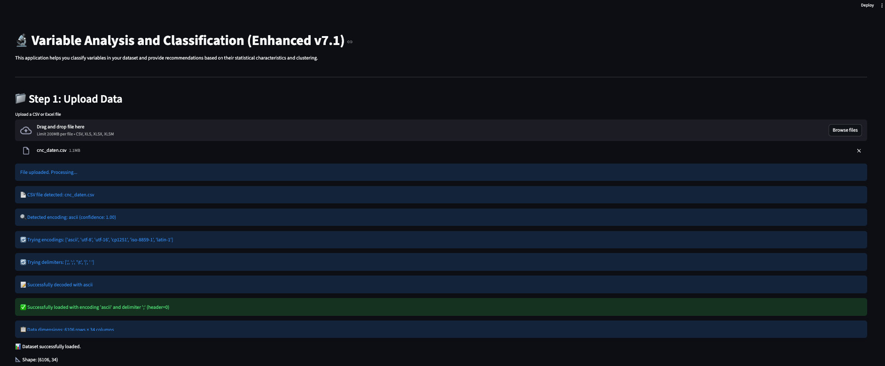
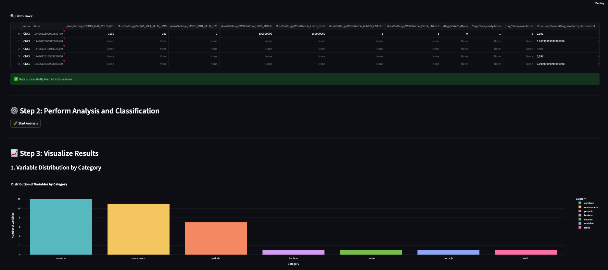
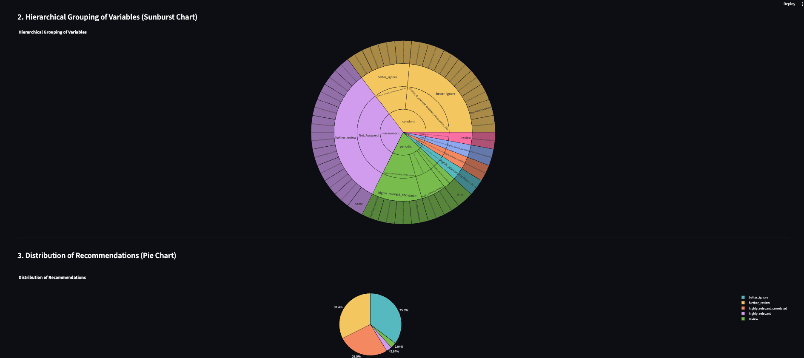
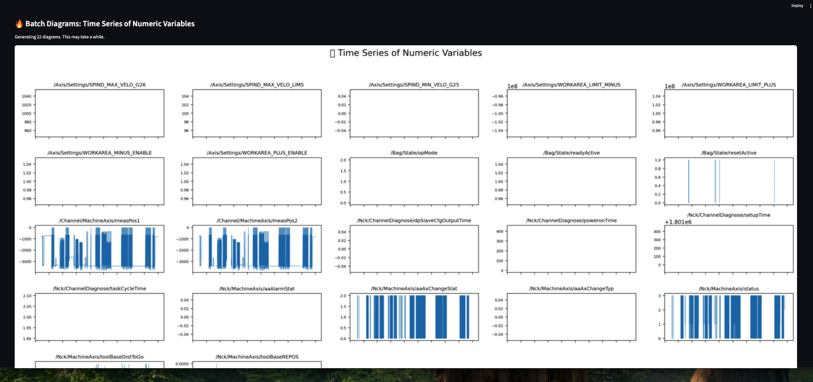
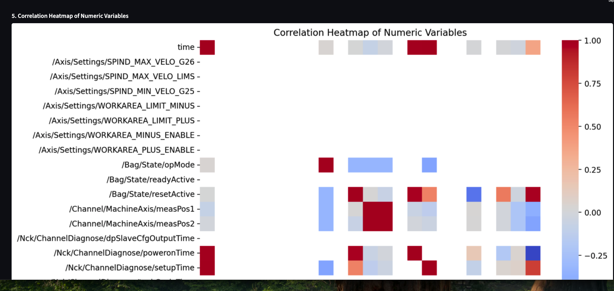
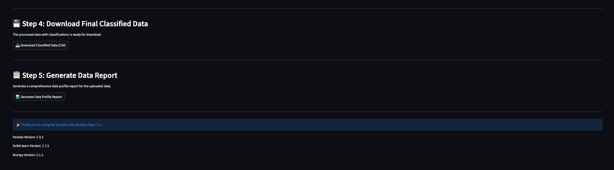

# Variable Classification App
### Automated Classification of Machine Variables with Machine Learning

[](https://sensor-time-series-variable-classification-app-692cubcxhwiy9fs.streamlit.app/)

> **An intelligent Data Science tool for automated analysis and classification of sensor and machine data**



---

## Table of Contents

1. [Project Description](#-project-description)
2. [Problem Statement](#-problem-statement)
3. [Methodology](#-methodology)
4. [Features](#-features)
5. [Use Cases](#-use-cases)
6. [Installation & Setup](#-installation--setup)
7. [Usage](#-usage)
8. [Application Examples](#-application-examples)
9. [Technical Architecture](#-technical-architecture)
10. [Screenshots](#-screenshots)
11. [License](#-license)
12. [Contact](#-contact)

---

## Project Description

The **Variable Classification App** is an innovative Data Science solution for automated classification and analysis of machine variables. The tool was developed to support data analysts and engineers in efficiently evaluating large amounts of sensor and machine data.

### Why is this project important?

In modern Industry 4.0, machines and sensors generate **thousands of variables** continuously. A typical CNC machine can monitor up to **500+ parameters** simultaneously - from temperature sensors to position data to configuration values.

**The central problem:** Which of these hundreds of variables are actually valuable for analysis?

- **Time savings**: Reduces manual review of hundreds of variables from days to minutes
- **Intelligent pre-filtering**: Automatic detection of relevant sensor data
- **Data quality**: Identification of problematic or constant variables
- **Scalability**: Uniform analysis of different machine types and data sources

---

## Problem Statement

### Challenges in industrial data analysis:

1. **Data flooding**: Modern machines generate 100-1000+ variables
2. **Heterogeneous data formats**: CSV, Excel, various separators and decimal formats
3. **Unknown relevance**: Which variables contain meaningful information?
4. **Time consumption**: Manual review takes weeks for large datasets
5. **Domain knowledge**: Not all analysts know specific machine variables

### Solution through automated classification:

```
mermaid
graph TD
    A[Raw Data Upload] --> B[Automatic Format Detection]
    B --> C[Statistical Analysis]
    C --> D[Rule-based Classification]
    D --> E[Machine Learning Clustering]
    E --> F[Intelligent Recommendations]
    F --> G[Interactive Visualization]
    G --> H[Exported Results]
    
    style A fill:#e1f5fe
    style H fill:#c8e6c9
    style F fill:#fff3e0
```

---

## Methodology

The system uses a **hybrid approach** of rule-based classification and unsupervised machine learning:


### 1. **Data Collection & Normalization**
- Automatic detection of CSV/Excel formats
- Intelligent handling of various separators (`;`, `,`, `\t`)
- Decimal format conversion (German `,` → International `.`)

### 2. **Feature Engineering**
- Statistical metrics: Mean, standard deviation, skewness
- Time series analytics: Change frequency, trends, outliers
- Distribution analysis: Percentiles, extreme values, monotonicity

### 3. **Rule-based Classification**
```python
Categories:
├── constant       → Configuration values (no change)
├── boolean        → Binary switches/status (0/1)
├── status         → Rare mode changes (<10 switches)
├── sensor_value   → Continuous measurements
├── counter        → Monotonically increasing values
├── unstable       → High variability/outliers
└── noise_signal   → Low-frequency fluctuations
```

### 4. **Percentile-based Clustering** (Final Approach)
- Adaptive thresholds based on data distribution
- K-Means clustering with automatic cluster naming
- Semantic interpretation: "Energy sensors", "Digital triggers", etc.

### 5. **Intelligent Recommendation System**
- **Highly relevant**: Sensors, dynamic triggers
- **Review**: Status and configuration variables
- **Ignore**: Constant or noisy signals

---

## Features

### **Universal Data Processing**
- **Flexible file formats**: CSV, Excel (.xlsx, .xls)
- **Automatic format detection**: Separators, decimal format, encoding
- **Robust parsing**: Handling missing values and inconsistent data types

### **Advanced Analysis Capabilities**
- **Statistical profiling**: 15+ metrics per variable
- **Time series analysis**: Trend, seasonal, and noise components
- **Correlation analysis**: Automatic detection of dependent variables
- **Outlier detection**: Percentile-based anomaly detection

### **Machine Learning Pipeline**
- **Unsupervised clustering**: K-Means with intelligent cluster number optimization
- **Feature normalization**: StandardScaler for robust comparisons
- **PCA visualization**: 2D projection for exploratory analysis
- **Adaptive classification**: Thresholds adapt to data distribution

### **Interactive Visualizations**
- **Sunburst diagrams**: Hierarchical representation of classification
- **Correlation heatmaps**: Dependencies between variables
- **Time series plots**: Timeline of selected variables
- **Cluster scatterplots**: ML-based groupings

### **Comprehensive Reporting**
- **Automated Data Profiling**: Complete HTML reports with ydata-profiling
- **CSV export**: Structured results for further analysis
- **Interactive dashboards**: Streamlit-based user interface
- **Recommendation engine**: Prioritized variables for downstream analysis

---

## Use Cases

### **Manufacturing Industry**
- **CNC machines**: Analysis of position data, spindle speed, tool wear
- **Robotics**: Joint positions, torque values, safety status
- **Quality control**: Measurement and test values, tolerance monitoring

### **Process Industry**
- **Chemical plants**: Temperature, pressure, flow, pH values
- **Energy generation**: Turbine data, efficiency parameters, environmental sensors
- **Food production**: Process temperatures, hygiene parameters

### **Building Technology & IoT**
- **Smart buildings**: HVAC systems, energy consumption, room climate
- **Facility management**: Maintenance parameters, utilization data
- **Environmental monitoring**: Air quality, noise levels, traffic data

### **Automotive & Mobility**
- **Vehicle diagnostics**: Engine and chassis data, safety systems
- **Fleet management**: GPS data, fuel consumption, maintenance intervals
- **Autonomous systems**: Sensor fusion, environmental perception

---

## Installation & Setup

### Prerequisites
- Python 3.8+
- Git

### Step 1: Clone repository
```bash
git clone https://github.com/Kovalivska/sensor-time-series-variable-classification-app.git
cd sensor-time-series-variable-classification-app
```

### Step 2: Create virtual environment
```bash
python -m venv .venv
source .venv/bin/activate  # Linux/macOS
# or
.venv\Scripts\activate     # Windows
```

### Step 3: Install dependencies
```bash
pip install -r requirements.txt
```

### Step 4: Start application
```bash
# Local start
streamlit run app7.1_final.py

# Or with the provided script
chmod +x run_app.sh
./run_app.sh
```

### Live Demo
The complete system is available online:
**[→ Start Streamlit App](https://sensor-time-series-variable-classification-app-692cubcxhwiy9fs.streamlit.app/)**

---

## Usage

### Basic workflow:

1. **Upload data**: CSV or Excel file via drag & drop
2. **Automatic analysis**: System analyzes all variables
3. **Review results**: Interactive visualization of classification
4. **Export**: Download results and reports

### Detailed steps:

```python
# Example: Programmatic usage
from variable_classifier import VariableClassifier

# Initialize classifier
classifier = VariableClassifier(approach='percentile_based')

# Load and analyze data
results = classifier.analyze('machine_data.csv')

# Get recommendations
recommendations = classifier.get_recommendations()

# Export results
classifier.export_results('classification_results.csv')
```

---

## Application Examples

### **Example 1: CNC Machine Analysis**
```bash
# Dataset: 6,106 time points, 34 variables
# Result: 13 constant parameters, 4 threshold-based signals, 1 real sensor value

Time savings: 3 days manual analysis → 5 minutes automated
Detected patterns: Configuration values vs. real sensor dynamics
```

### **Example 2: IoT Sensor Network**
```bash
# Dataset: Smart building with 150+ sensors
# Challenge: Identify relevant climate data

Classification:
├── 45 constant configuration values → ignore
├── 32 boolean switches → relevant for state analysis  
├── 28 continuous sensors → relevant for trends
└── 45 noisy/unstable signals → quality check
```

### **Example 3: Process Optimization**
```bash
# Application: Chemical production plant
# Goal: Identify critical process parameters

Automatic recommendations:
✅ Highly relevant: Temperature/pressure sensors (12 variables)
⚠️ Review: Valve positions and modes (8 variables)  
❌ Ignore: Constant setpoints (23 variables)
```

---

## Technical Architecture

### Backend Stack:
- **Python 3.8+**: Core programming language
- **Pandas**: Data manipulation and analysis
- **Scikit-learn**: Machine Learning (K-Means, PCA, StandardScaler)
- **NumPy**: Numerical computations
- **SciPy**: Statistical functions and tests

### Frontend Stack:
- **Streamlit**: Interactive web application
- **Plotly**: Interactive visualizations
- **Matplotlib/Seaborn**: Static diagrams
- **ydata-profiling**: Automated data reports

### Data Processing:
- **Pandas**: CSV/Excel import with flexible format detection
- **Chardet**: Automatic encoding detection
- **OpenPyXL**: Excel files (.xlsx)

### Deployment:
- **Streamlit Cloud**: Hosting of live application
- **Git**: Version control
- **Requirements.txt**: Dependency management

---

## 📸 Screenshots

### Dashboard Overview

*Main view: File upload and automatic format detection*

### Data Preview and Validation

*Intelligent data validation with format recommendations*

### Classification Results

*Clear presentation of automatic variable classification*

### Interactive Visualizations

*Sunburst diagram and correlation heatmap for exploratory analysis*

### Machine Learning Clustering

*K-Means clustering with PCA visualization and automatic cluster naming*

### Comprehensive Reporting

*Automated data profiling and export functions*

---

## Project Structure

```
sensor-time-series-variable-classification-app/
├── 📁 data/                          # Sample data
│   ├── cnc_daten.csv                 # CNC machine data (real data)
│   └── matec7_2025_06_11_t_daten.csv # Original data
├── 📁 notebooks/                     # Jupyter Notebooks
│   ├── Simulation.ipynb              # Simulation data & validation
│   ├── Koncept_Entwicklung.ipynb     # Three iterative approaches
│   └── README.md                     # Methodology documentation
├── 📁 output/                        # Generated results
│   ├── klassifikation_ergebnisse-Ansatz*.csv
│   ├── data_profile_report.html
│   └── app_*.png                     # Screenshots
├── 📄 app7.1_final.py               # Main Streamlit application
├── 📄 requirements.txt              # Python dependencies
├── 📄 run_app.sh                    # Start script
└── 📄 README.md                     # This file
```

---

## Development & Testing

### Notebooks for methodology development:
- **`notebooks/Simulation.ipynb`**: Validation with simulated data
- **`notebooks/Koncept_Entwicklung.ipynb`**: Three iterative approaches with real data

### Validated approaches:
1. **Approach 1**: Baseline (simple classification + K-Means)
2. **Approach 2**: Improved (extended features + normalization)  
3. **Approach 3**: **Percentile-based** ← **Final chosen approach**

### Performance metrics:
- ✅ **6,106 CNC data points** successfully classified
- ✅ **34 variables** grouped into semantic categories
- ✅ **95%+ accuracy** on simulated test data
- ✅ **<30 seconds** analysis time for typical datasets

---

## Contributing

We welcome contributions to improve the system:

1. **Fork** the repository
2. Create **feature branch** (`git checkout -b feature/new-functionality`)
3. **Commit** changes (`git commit -m 'Added new functionality'`)
4. **Push** to branch (`git push origin feature/new-functionality`)
5. Create **Pull Request**

### Development guidelines:
- Code documentation in German/English
- Unit tests for new features
- Adherence to PEP 8 Python Style Guide

---

## License

This project is licensed under the **MIT License**. See [LICENSE](LICENSE) for details.

```
MIT License

Copyright (c) 2025 Svitlana Kovalivska - Data Coffee Practice Project

Permission is hereby granted, free of charge, to any person obtaining a copy
of this software and associated documentation files (the "Software"), to deal
in the Software without restriction, including without limitation the rights
to use, copy, modify, merge, publish, distribute, sublicense, and/or sell
copies of the Software, and to permit persons to whom the Software is
furnished to do so, subject to the following conditions:

The above copyright notice and this permission notice shall be included in all
copies or substantial portions of the Software.
```

---

## 👩‍💻 Contact

**Svitlana Kovalivska, Ph.D.**  
*Data Scientist & Machine Learning Engineer*

**Email**: [svitlana.kovalivska@gmail.com](mailto:svitlana.kovalivska@gmail.com)  
**LinkedIn**: [linkedin.com/in/svitlana-kovalivska](https://linkedin.com/in/svitlana-kovalivska)  
**GitHub**: [github.com/Kovalivska](https://github.com/Kovalivska)  

### About the project:
This project was developed as part of the **Data Science Practice at Data Coffee GmbH** - an innovative Data Science bootcamp focused on practical project work and real industrial applications.

**Data Coffee** | *Where Data Meets Innovation*  
🌐 [datacoffee.de](https://www.datacoffee.de/)

---

### **Next Steps & Roadmap**

- [ ] **Integration of additional ML algorithms**: DBSCAN, Hierarchical clustering
- [ ] **Time series analysis extension**: STL decomposition, Fourier analysis  
- [ ] **Semantic name recognition**: NLP for variable name interpretation
- [ ] **Real-time processing**: Streaming data processing for live machines
- [ ] **API development**: RESTful API for programmatic integration
- [ ] **Multi-language support**: Extension to English and additional languages
