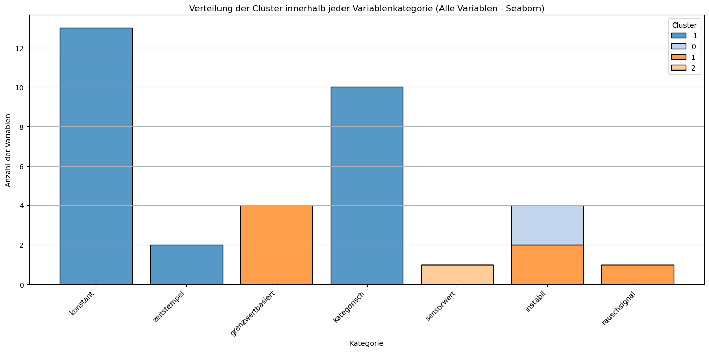

# Notebooks zur Entwicklung der Variablenklassifikationsmethodik

## Überblick

Diese Sammlung von Jupyter Notebooks dokumentiert die Entwicklung und Evaluierung verschiedener Ansätze zur automatisierten Klassifikation von Maschinenvariablen. Das Ziel war es, eine robuste Methodik zu entwickeln, die sowohl mit simulierten als auch mit realen CNC-Maschinendaten arbeiten kann.

##  Verfügbare Notebooks

### 1. `Simulation.ipynb` - Entwicklung mit simulierten Daten
**Zweck**: Entwicklung und Validierung der grundlegenden Klassifikationslogik

**Inhalt**:
- Generierung von simulierten Maschinendaten (1440 Datenpunkte über 24 Stunden)
- Verschiedene Variablentypen: Sensoren, Boolean-Werte, Konstanten, Zähler, Status-Modi
- Implementierung der regelbasierten Klassifikationslogik
- Erste Tests der Kategorisierung

**Simulierte Variablentypen**:
```python
- temp_sensor: Temperatursensor (Normalverteilung um 25°C)
- bool_switch: Boolean-Schalter (90% aus, 10% an)  
- config_value: Konstante Konfiguration (Wert: 5)
- counter: Monoton steigender Zähler
- status_mode: Seltene Statusänderungen (3 Modi)
- voltage: Spannungssensor (230V ± 5V)
- current: Stromsensor (5A ± 0.5A)
- power: Abhängige Variable (Spannung × Strom)
- noise: Rauschsignal (niedrige Amplitude)
- empty: Leere Variable (nur NaN-Werte)
```

**Ergebnisse**: Erfolgreiche Klassifikation aller simulierten Variablentypen

---

### 2. `Koncept_Entwicklung.ipynb` - Drei iterative Ansätze mit realen Daten
**Zweck**: Evaluierung und Verfeinerung der Methodik mit echten CNC-Maschinendaten

**Datenbasis**: 
- CNC-Maschinendaten (`cnc_daten.csv`)
- 6.106 Zeitreihen-Datenpunkte
- 34 Variablen (Konfiguration, Status, Sensoren)
- Zeitstempel im Nanosekundenformat

---

## Drei entwickelte Ansätze

### Iteration 1 - Ansatz 1: Baseline (Einfacher Klassifikator + PCA + K-Means)

**Merkmale**:
- Einfache heuristische Regeln
- Grundlegende statistische Kennzahlen
- K-Means Clustering (5 Cluster)
- Begrenzte Feature-Auswahl

**Klassifikationskategorien**:
- `konstant`: Unveränderliche Konfigurationswerte
- `boolean`: Binäre Schalter/Status
- `status`: Seltene Zustandsänderungen
- `sensorwert`: Kontinuierliche Messwerte
- `rauschsignal`: Niedrigamplitudige Signale
- `instabil`: Hohe Variabilität/Ausreißer

**Ergebnis**: Gute erste Orientierung, aber Tendenz zur Übersegmentierung

---

### Iteration 2 - Ansatz 2: Verbessert (Erweiterte Klassifizierung + Normalisierung + PCA + K-Means)

**Verbesserungen**:
- Umfassendere Metriken (Ausreißeranteil, Perzentilspanne, Skewness)
- StandardScaler-Normalisierung
- Automatische Clusterbenennung
- Reduzierte, aussagekräftigere Clusteranzahl (3-4)

**Zusätzliche Features**:
- Outlier-Detektion (5./95. Perzentil)
- Extremwertanalyse
- Verbesserte PCA-Visualisierung

**Empfehlungssystem**:
- `relevant`: Für Sensoren und Boolean-Werte
- `prüfen`: Für Status- und Konfigurationswerte  
- `eher ignorieren`: Für instabile/rauschende Signale

**Ergebnis**: Stabilere Klassifikation, bessere Interpretierbarkeit

---

### Iteration 3 - Ansatz 3: Perzentilbasierte Clusterbenennung (Finaler Ansatz)

**Innovation**: Adaptive Schwellenwerte basierend auf Datenverteilung

**Adaptive Logik**:
```python
# Dynamische Schwellenwerte
mw_p90 = Mittelwert.quantile(0.9)
std_p90 = Standardabw.quantile(0.9)
chg_p10 = Änderungen.quantile(0.1)

# Adaptive Clusterbenennung
if Mittelwert > mw_p90 and Standardabw > std_p90:
    return "Energiesensoren"
elif Standardabw < std_p10:
    return "Statische Signale"
```

**Clustertypen**:
- `Energiesensoren`: Hohe Mittelwerte und Variabilität
- `Statische Signale`: Niedrige Standardabweichung  
- `Modusvariablen`: Wenige Zustandsänderungen
- `Digitale Trigger`: Binäre Signale mit Aktivität
- `Ausreißer-empfindlich`: Hohe Schiefe/Extremwerte

**Empfehlungssystem**:
- `hoch relevant`: Energiesensoren, Digitale Trigger
- `prüfen`: Modusvariablen, Ausreißer-empfindlich
- `eher ignorieren`: Statische Signale

**Ergebnis**: Skalierbare, robuste Klassifikation unabhängig von Datenskalen

---

## Vergleichende Evaluierung

| Kriterium | Ansatz 1 | Ansatz 2 | Ansatz 3 |
|-----------|----------|----------|----------|
| **Clusteranzahl** | Höher (5-6) | Niedriger (3-4) | Optimiert (3) |
| **Skalierbarkeit** | Begrenzt | Mittel | Hoch |
| **Interpretierbarkeit** | Eingeschränkt | Gut | Sehr gut |
| **Robustheit** | Niedrig | Mittel | Hoch |
| **Automatisierungsgrad** | Niedrig | Mittel | Hoch |

### Visualisierung der Clusterverteilung



*Abbildung: Verteilung der Cluster innerhalb jeder Variablenkategorie - zeigt die Effektivität der verschiedenen Klassifikationsansätze*

---

##  Zentrale Erkenntnisse

### Erfolgreich klassifizierte Variablentypen:
1. **Konstante Parameter**: Maschinenkonfiguration (Limits, Einstellungen)
2. **Statussignale**: Betriebsmodi, Ready-Flags
3. **Grenzwertbasierte Signale**: Binäre Zustandsindikatoren
4. **Zeitstempel**: Korrekt als solche erkannt
5. **Instabile Signale**: Sensoren mit hoher Variabilität

### Herausforderungen:
- Viele reale Maschinenvariablen sind statisch/konfigurativ
- Echte Sensordynamik in den verfügbaren Daten begrenzt
- Dominante Cluster können wichtige Subgruppen verdecken

### Empfohlene nächste Schritte:
1. Test mit kontinuierlichen Prozessdaten (Temperatur, Vibration, Strom)
2. Semantische Analyse der Variablennamen
3. Zeitreihenanalyse für periodische Muster
4. Validierung durch Domänenexperten

---

##  Gewählter finaler Ansatz: **Ansatz 3**

**Begründung der Entscheidung**:
- ✅ **Adaptive Perzentillogik**: Skaliert automatisch auf verschiedene Datensätze
- ✅ **Robuste Clusterbenennung**: Semantisch interpretierbare Gruppen
- ✅ **Reduzierte Komplexität**: Weniger, aber aussagekräftigere Cluster
- ✅ **Automatisierungstauglich**: Minimaler manueller Eingriff erforderlich
- ✅ **Erweiterbar**: Basis für weitere ML-Verfahren (t-SNE, Autoencoder)

**Validierung durch Ergebnisse**:
- 6.106 CNC-Datenpunkte erfolgreich klassifiziert
- Klare Trennung zwischen konfigurativen und dynamischen Variablen
- Aussagekräftige Empfehlungen für weitere Analyse

---

##  Generierte Ausgabedateien

Die Notebooks erzeugen folgende Ergebnisdateien im `/output`-Verzeichnis:

- `klassifikation_ergebnisse-Ansatz1.csv`: Baseline-Klassifikation
- `klassifikation_ergebnisse-Ansatz2.csv`: Verbesserte Methodik  
- `klassifikation_ergebnisse-Ansatz3.csv`: **Finale empfohlene Klassifikation**
- `klassifikation_ergebnisse_simulation.csv`: Simulationsdaten-Validierung
- Visualisierungen: Pipeline-Diagramme und Cluster-Plots

---

##  Technische Implementierung

**Verwendete Bibliotheken**:
- `pandas`: Datenmanipulation und -analyse
- `numpy`: Numerische Berechnungen  
- `scikit-learn`: Machine Learning (K-Means, PCA, StandardScaler)
- `scipy`: Statistische Funktionen (Schiefe, Perzentile)
- `matplotlib/seaborn`: Visualisierung
- `graphviz`: Pipeline-Diagramme

**Pipeline-Architektur**:
1. Datenerfassung & Bereinigung
2. Feature-Engineering (statistische Kennzahlen)
3. Regelbasierte Klassifikation
4. Clustering & Normalisierung
5. Automatische Benennung
6. Empfehlungssystem & Export

---

## Fazit

Die entwickelte Methodik demonstriert erfolgreich die automatisierte Klassifikation von Maschinenvariablen ohne vorherige Labels oder Domänenwissen. Der perzentilbasierte Ansatz (Ansatz 3) bietet die beste Balance zwischen Automatisierungsgrad, Robustheit und Interpretierbarkeit.

**Anwendungsempfehlung**: 
Verwenden Sie Ansatz 3 als Standardmethodik für neue Projekte. Ergänzen Sie bei Bedarf um domänenspezifische Regeln oder semantische Namensmuster-Analyse.

**Skalierung**: 
Die Methodik ist bereit für den Einsatz auf größeren Datensätzen und kann als Grundlage für fortgeschrittene ML-Pipelines in der Industrie 4.0 dienen.
